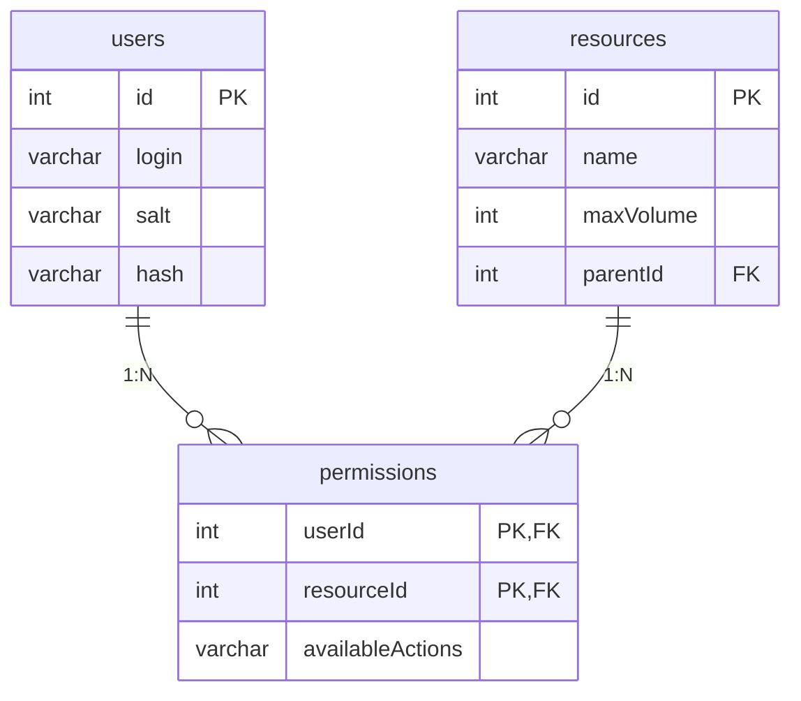

# Сущности
1. Пользователь
id - Uniq int
login -  String
salt - String
hash - String
2. Ресурс
id - Uniq
name: String,
maxVolume: Int = 10,
parentId: Int = null
3. Разрешение
User.id
resource.id
availableActions String с 3 буквами (RWE) (R-E)

Предположительная схема:

Структура таблиц:
CREATE TABLE users (
    id INT AUTO_INCREMENT PRIMARY KEY,
    login VARCHAR(255) NOT NULL UNIQUE,
    salt VARCHAR(255) NOT NULL,
    hash VARCHAR(255) NOT NULL
);

CREATE TABLE resources (
    id INT AUTO_INCREMENT PRIMARY KEY,
    name VARCHAR(255) NOT NULL,
    maxVolume INT DEFAULT 10,
    parentId INT,
    FOREIGN KEY (parentId) REFERENCES resources(id) ON DELETE CASCADE
);

CREATE TABLE permissions (
    userId INT NOT NULL,
    resourceId INT NOT NULL,
    availableActions VARCHAR(3) NOT NULL CHECK (availableActions GLOB '[R-][W-][E-]'), //Вот эта штука сделана, как проверка "R или -"
    PRIMARY KEY (userId, resourceId),
    FOREIGN KEY (userId) REFERENCES users(id) ON DELETE CASCADE,
    FOREIGN KEY (resourceId) REFERENCES resources(id) ON DELETE CASCADE
);

Добавление тестовых данных:
INSERT INTO users (id, login, salt, hash) VALUES 
(1, 'alice', 'saltAlice', '0ded4a676ee2fcd61ab5772e67ac33ef2ada6a929470cac9cb703cc9e6315c85');

INSERT INTO resources (id, name, maxVolume, parentId) VALUES 
(1, 'root', 100, NULL),
(2, 'A', 50, 1),
(3, 'B', 20, 2),
(4, 'C', 10, 3),
(5, 'D', 10, 1);

INSERT INTO permissions (userId, resourceId, availableActions) VALUES 
(1, 2, 'R--'), 
(1, 3, 'R--'),
(1, 4, 'R--');